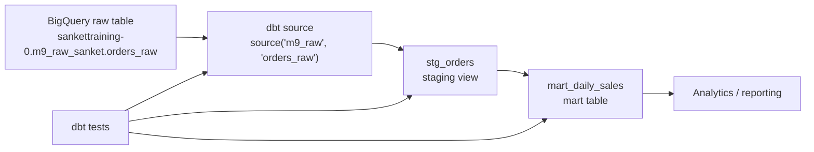

# Project Explainer: Data Engineering GCP

This repository is a small data engineering project that uses dbt with Google BigQuery. It defines a simple analytics pipeline:

1. Read raw order data from a BigQuery source table.
2. Clean and standardize the raw orders in a staging model.
3. Aggregate the staged orders into a daily sales mart.
4. Validate the source and model data with dbt tests.

The project is a good foundation for learning how dbt organizes analytics engineering work on GCP.

## Repository Layout

```text
.
├── README.md
├── PROJECT_EXPLAINER.md
├── .gitignore
├── .vscode/
│   ├── extensions.json
│   └── settings.json
└── dbt_project/
    ├── README.md
    ├── dbt_project.yml
    ├── requirements.txt
    └── models/
        ├── staging/
        │   ├── _staging__sources.yml
        │   ├── _staging__models.yml
        │   └── stg_orders.sql
        └── marts/
            ├── _marts__models.yml
            └── mart_daily_sales.sql
```

Generated folders such as `dbt_project/target/`, `dbt_project/logs/`, `dbt_project/dbt_packages/`, and `dbt_project/.venv/` are intentionally ignored by Git.

## Architecture



At a high level, BigQuery stores the data and dbt defines the transformations. dbt does not store the data itself; it compiles the SQL models and runs them against BigQuery.

## Data Flow

### 1. Raw Source

The raw input table is declared in:

```text
dbt_project/models/staging/_staging__sources.yml
```

The source is named `m9_raw` in dbt:

```yaml
sources:
  - name: m9_raw
    database: sankettraining-0
    schema: m9_raw_sanket
    tables:
      - name: orders_raw
```

This maps the dbt source:

```sql
{{ source('m9_raw', 'orders_raw') }}
```

to the BigQuery table:

```text
sankettraining-0.m9_raw_sanket.orders_raw
```

The source has tests on important raw fields:

- `order_id`: unique and not null
- `customer_id`: not null
- `order_date`: not null

These tests help catch bad upstream data before it flows into the modeled layer.

### 2. Staging Model

The staging model lives in:

```text
dbt_project/models/staging/stg_orders.sql
```

Code:

```sql
select
    order_id,
    customer_id,
    order_date,
    country,
    cast(amount as numeric) as amount
from {{ source('m9_raw', 'orders_raw') }}
where amount > 0
```

What it does:

- Selects only the columns needed downstream.
- Converts `amount` to BigQuery `numeric`.
- Removes rows where `amount <= 0`.
- Uses `source()` so dbt understands lineage from the raw BigQuery table.

In `dbt_project.yml`, staging models are configured as views:

```yaml
models:
  dataengggcp:
    staging:
      +materialized: view
```

That means `stg_orders` will be created as a BigQuery view. This is a common pattern because staging models are usually lightweight cleaning layers over raw data.

The staging model is documented and tested in:

```text
dbt_project/models/staging/_staging__models.yml
```

Current tests:

- `order_id`: unique and not null

### 3. Mart Model

The mart model lives in:

```text
dbt_project/models/marts/mart_daily_sales.sql
```

Code:

```sql
select
    order_date,
    country,
    count(*) as orders,
    sum(amount) as revenue
from {{ ref('stg_orders') }}
group by order_date, country
```

What it does:

- Reads from the staging model using `ref('stg_orders')`.
- Groups orders by `order_date` and `country`.
- Calculates:
  - `orders`: number of orders
  - `revenue`: total order amount

The use of `ref()` is important. It tells dbt that `mart_daily_sales` depends on `stg_orders`, so dbt can build the models in the correct order.

In `dbt_project.yml`, marts are configured as tables:

```yaml
models:
  dataengggcp:
    marts:
      +materialized: table
```

That means `mart_daily_sales` will be created as a physical BigQuery table. This is useful for downstream reporting because aggregated mart tables are usually faster and more stable for dashboards.

The mart model is documented and tested in:

```text
dbt_project/models/marts/_marts__models.yml
```

Current tests:

- `order_date`: not null
- `orders`: not null
- `revenue`: not null

## dbt Project Configuration

The main dbt config file is:

```text
dbt_project/dbt_project.yml
```

Key settings:

```yaml
name: 'dataengggcp'
version: '1.0.0'
config-version: 2

profile: 'dataengggcp'

model-paths: ["models"]
analysis-paths: ["analyses"]
test-paths: ["tests"]
seed-paths: ["seeds"]
macro-paths: ["macros"]
snapshot-paths: ["snapshots"]
```

Important pieces:

- `name`: dbt project name.
- `profile`: points dbt to a local profile named `dataengggcp`.
- `model-paths`: tells dbt where SQL models live.
- `clean-targets`: tells dbt what generated folders can be cleaned.
- `models`: controls default materialization by folder.

The profile itself is not committed to the repo. It should live at:

```text
~/.dbt/profiles.yml
```

That is normal dbt behavior because profiles often contain machine-specific connection settings.

## Tools, Languages, and Technologies

### Programming and Query Languages

- SQL: used for dbt transformations.
- YAML: used for dbt configuration, source declarations, model documentation, and tests.
- Markdown: used for project documentation.

### Data and Cloud Tools

- Google BigQuery: cloud data warehouse where source tables, views, and marts live.
- Google Cloud SDK / `gcloud`: used for local GCP authentication.
- dbt Core: transformation framework.
- dbt BigQuery adapter: lets dbt run models against BigQuery.

### Development Tools

- Python virtual environment: isolates dbt dependencies.
- VS Code: recommended editor.
- dbt Power User extension: helpful for dbt lineage, previews, and model actions.
- Cloud Code extension: helpful for GCP work in VS Code.
- Git and GitHub: version control and pull request workflow.

## Python Dependencies

Dependencies are pinned in:

```text
dbt_project/requirements.txt
```

Current dependencies:

```text
dbt-core==1.10.22
dbt-bigquery==1.10.2
```

These install dbt itself and the BigQuery adapter.

## Ideal Installation Steps

These steps assume a new machine and a working GCP account with access to the BigQuery project.

### 1. Install System Tools

Install these first:

- Git
- Python 3.10 or newer
- Google Cloud SDK
- VS Code, optional but recommended

Although the current local virtual environment was created with Python 3.9.6, Python 3.10+ is a better target because Google Python libraries are warning that Python 3.9 is past support.

### 2. Clone the Repository

```bash
git clone <repo-url>
cd dataengggcp
```

### 3. Authenticate to GCP

```bash
gcloud auth login
gcloud auth application-default login
```

The first command authenticates the `gcloud` CLI. The second creates application default credentials that libraries such as the BigQuery client can use.

### 4. Create the Python Virtual Environment

From the repository root:

```bash
cd dbt_project
python3 -m venv .venv
source .venv/bin/activate
pip install -r requirements.txt
```

### 5. Configure dbt Profile

Create or edit:

```text
~/.dbt/profiles.yml
```

Example profile:

```yaml
dataengggcp:
  target: dev
  outputs:
    dev:
      type: bigquery
      method: oauth
      project: sankettraining-0
      dataset: dbt_dev
      threads: 4
      timeout_seconds: 300
      location: US
      priority: interactive
```

Notes:

- `project` should be the GCP project where dbt creates models.
- `dataset` is the target dataset for dbt-created objects.
- `method: oauth` uses your local `gcloud` authentication.
- `location` must match your BigQuery dataset location.

### 6. Verify dbt Connection

From `dbt_project/` with the virtual environment activated:

```bash
dbt debug
```

This checks whether dbt can find the project, read the profile, and connect to BigQuery.

### 7. Inspect Project Resources

```bash
dbt ls
```

Expected resources include:

- `dataengggcp.staging.stg_orders`
- `dataengggcp.marts.mart_daily_sales`
- `source:dataengggcp.m9_raw.orders_raw`
- data tests for source, staging, and mart fields

### 8. Build Models

```bash
dbt run
```

This creates or updates:

- `stg_orders` as a view
- `mart_daily_sales` as a table

### 9. Run Tests

```bash
dbt test
```

This validates the assumptions documented in the YAML files, such as uniqueness and non-null constraints.

### 10. Generate and Serve Documentation

```bash
dbt docs generate
dbt docs serve
```

This creates dbt's interactive documentation site, including model descriptions, tests, columns, and lineage.

## Common Daily Workflow

From the repository root:

```bash
cd dbt_project
source .venv/bin/activate
dbt debug
dbt ls
dbt run
dbt test
```

When developing a new model:

1. Create or update a SQL model under `models/`.
2. Add documentation and tests in the matching YAML file.
3. Run `dbt run --select <model_name>`.
4. Run `dbt test --select <model_name>`.
5. Check lineage with `dbt ls` or dbt docs.
6. Commit changes on a feature branch.

## Git Workflow

The project README describes this intended Git workflow:

```bash
git checkout -b <type>/<short-description>
```

Examples:

```bash
git checkout -b feat/add-customers-staging-model
git checkout -b fix/order-amount-cleaning
```

Then:

1. Make changes.
2. Run dbt checks.
3. Commit the changes.
4. Open a pull request into `main`.
5. Merge after review.

The `.gitignore` is already configured to avoid committing generated files and credentials.

## Current Model Lineage

```text
source('m9_raw', 'orders_raw')
    -> stg_orders
        -> mart_daily_sales
```

In dbt terms:

- `source()` points to an external/raw table.
- `ref()` points to another dbt model.
- dbt uses both to build a dependency graph.

## Current Tests

Source tests:

```text
m9_raw.orders_raw.order_id: unique, not_null
m9_raw.orders_raw.customer_id: not_null
m9_raw.orders_raw.order_date: not_null
```

Staging tests:

```text
stg_orders.order_id: unique, not_null
```

Mart tests:

```text
mart_daily_sales.order_date: not_null
mart_daily_sales.orders: not_null
mart_daily_sales.revenue: not_null
```

## Suggested Future Improvements

The project is intentionally small, but there are several natural next steps:

- Add a `customers` source and staging model.
- Add accepted values tests for `country` if the valid country list is known.
- Add a test to ensure `amount > 0` in `stg_orders`.
- Add freshness checks to the raw source if the table is updated regularly.
- Add more documentation for each column, not just model-level descriptions.
- Add CI to run `dbt parse`, `dbt compile`, or selected tests on pull requests.
- Upgrade the local Python environment to Python 3.10 or newer.
- Add a `packages.yml` file if the project starts using dbt packages such as `dbt_utils`.

## Quick Command Reference

Run these from `dbt_project/`:

```bash
source .venv/bin/activate
dbt debug
dbt ls
dbt run
dbt test
dbt docs generate
dbt docs serve
dbt clean
```

## Mental Model

Think of the project in layers:

```text
Raw data
  BigQuery source table owned by the upstream system

Staging
  Light cleaning, casting, renaming, filtering

Marts
  Business-ready aggregations for reporting and analysis

Tests and docs
  Data quality checks and human-readable project knowledge
```

This structure keeps the pipeline understandable as it grows. Raw data remains separate from cleaned data, cleaned data remains separate from business-level marts, and dbt keeps the dependencies visible through `source()` and `ref()`.
